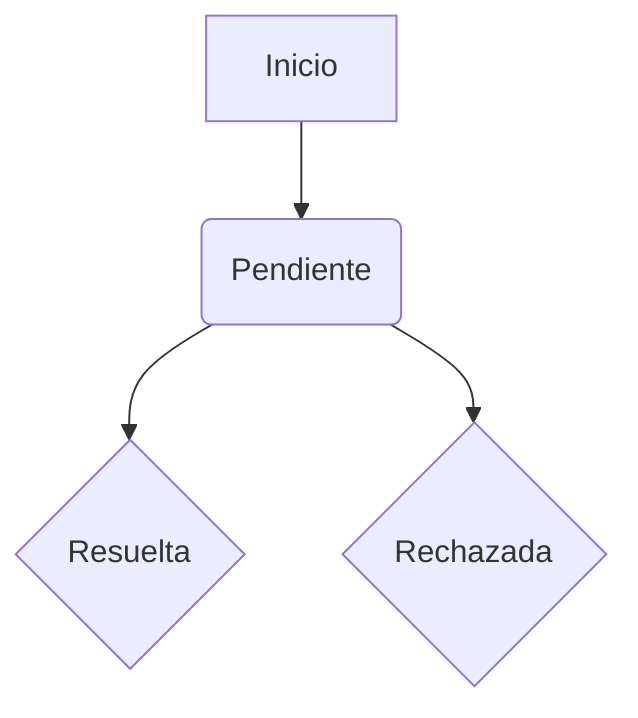

# ¿Qué es JSON?

**JSON** (JavaScript Object Notation) es un formato ligero para intercambiar datos entre aplicaciones. Es fácil de leer y escribir para humanos y máquinas. En las APIs, los datos suelen enviarse y recibirse en formato JSON.
**Diagrama: flujo de datos con JSON**

```
**Ejemplo de JSON:**
```json
{
}
```

**Ejemplo visual de conversión:**
```js
const producto = { id: 1, name: "Camiseta", price: 15 };
const textoJSON = JSON.stringify(producto); // Convierte a texto JSON
const objeto = JSON.parse(textoJSON); // Convierte de texto JSON a objeto JS
```

---
# ¿Qué son las promesas en JavaScript y React?

**Diagrama: ciclo de vida de una promesa**

Una **promesa** es una forma de manejar operaciones asíncronas, es decir, tareas que no se completan de inmediato (como pedir datos a un servidor). Una promesa puede estar en uno de estos estados:
## Tipos de promesas en React

En React, usamos promesas principalmente para:
1. **Promesas con .then() y .catch():**

  - Se usan para encadenar acciones cuando la promesa se resuelve o se rechaza.
   ```jsx
   fetch("https://api.example.com/products")
     .then((response) => response.json())
     .catch((error) => {
       // Manejar el error
     });
2. **Promesas con async/await:**
  - Permiten escribir código asíncrono de forma más clara y parecida al código normal.
  - Ejemplo:
   async function getProducts() {
     try {
       const response = await fetch("https://api.example.com/products");
       // Usar los datos
     } catch (error) {
       // Manejar el error
     }
   }
   ```
# ¿Qué es fetch y cómo funciona?

`fetch` es una función nativa de JavaScript que permite hacer peticiones HTTP (como GET, POST, PUT, DELETE) a servidores o APIs. Devuelve una promesa que se resuelve con la respuesta del servidor.
**Ejemplo básico de fetch:**

```js
fetch("https://api.example.com/products")
  .then((response) => response.json())
  .then((data) => {
    // Usar los datos recibidos
  })
  .catch((error) => {
    // Manejar el error
  });
```
En React, usamos fetch para interactuar con APIs y gestionar datos en un CRUD.

---
# ¿Qué es un CRUD?

CRUD son las siglas de **Create, Read, Update, Delete** (Crear, Leer, Actualizar, Borrar). Es el conjunto de operaciones básicas que se pueden realizar sobre los datos de una aplicación. Por ejemplo, en una tienda online, el CRUD serían las acciones para añadir productos, ver la lista de productos, modificar un producto y eliminarlo.
**Ejemplo de operaciones CRUD:**

- **Create:** Añadir un nuevo producto.
- **Read:** Ver la lista de productos.
- **Update:** Editar la información de un producto.
- **Delete:** Eliminar un producto.

En React, normalmente usamos formularios y botones para realizar estas acciones, y los datos suelen guardarse en un servidor o en el estado de la aplicación.
---

# Ejemplo completo de CRUD con fetch en React

```jsx
import React, { useEffect, useState } from "react";

function ProductCRUD() {
  const [products, setProducts] = useState([]);
  const [loading, setLoading] = useState(true);
  const [error, setError] = useState(null);
  const [newProduct, setNewProduct] = useState("");
  // READ: Obtener productos
  useEffect(() => {
    fetch("https://api.example.com/products")
      .then((res) => res.json())
      .then((data) => {
        setProducts(data);
        setLoading(false);
      })
      .catch(() => {
        setError("Error al cargar los productos");
        setLoading(false);
      });
  }, []);

  // CREATE: Añadir producto
  const handleAdd = async () => {
    try {
      const res = await fetch("https://api.example.com/products", {
  method: "POST",
  headers: { "Content-Type": "application/json" },
  body: JSON.stringify({ name: newProduct }),
  });
  const added = await res.json();
  setProducts([...products, added]);
      setNewProduct("");
    } catch {
      setError("Error al añadir producto");
    }
  };

  // UPDATE: Editar producto
  const handleUpdate = async (id, name) => {
    try {
      const res = await fetch(`https://api.example.com/products/${id}`, {
  method: "PUT",
  headers: { "Content-Type": "application/json" },
  body: JSON.stringify({ name }),
  });
  const updated = await res.json();
  setProducts(products.map((p) => (p.id === id ? updated : p)));
    } catch {
      setError("Error al actualizar producto");
    }
  };

  // DELETE: Eliminar producto
  const handleDelete = async (id) => {
    try {
      await fetch(`https://api.example.com/products/${id}`, {
        method: "DELETE",
      });
      setProducts(products.filter((p) => p.id !== id));
    } catch {
      setError("Error al eliminar producto");
    }
  };

  if (loading) return <p>Cargando...</p>;
  if (error) return <p>{error}</p>;

  return (
    <div>
      <h3>CRUD de productos</h3>
      <input
        value={newProduct}
        onChange={(e) => setNewProduct(e.target.value)}
        placeholder="Nuevo producto"
      />
      <button onClick={handleAdd}>Añadir</button>
      <ul>
        {products.map((product) => (
          <li key={product.id}>
            <input
              value={product.name}
              onChange={(e) => handleUpdate(product.id, e.target.value)}
            />
            <button onClick={() => handleDelete(product.id)}>Eliminar</button>
          </li>
        ))}
      </ul>
    </div>
  );
}
```
## Resumen y consejos para principiantes

- Un CRUD permite gestionar datos con las operaciones básicas: crear, leer, actualizar y borrar.
- Las promesas permiten manejar tareas asíncronas como peticiones a APIs.
- En React, puedes usar promesas con `.then()`/`.catch()` o con `async/await` para escribir código más claro y moderno.
- JSON es el formato estándar para enviar y recibir datos en APIs.
- El método `fetch` es la forma más común de conectar tu app con un servidor.
- Siempre que edites (PUT) un recurso, incluye el `id` en el cuerpo para asegurar que la API lo reconozca.

**¡Practica con ejemplos y prueba los diagramas para entender mejor el flujo de datos!**
# ¿Qué es JSON?

**JSON** (JavaScript Object Notation) es un formato ligero para intercambiar datos entre aplicaciones. Es fácil de leer y escribir para humanos y máquinas. En las APIs, los datos suelen enviarse y recibirse en formato JSON.

**Ejemplo de JSON:**

```json
{
  "id": 1,
  "name": "Camiseta",
  "price": 15
}
```

En JavaScript, puedes convertir un objeto a JSON con `JSON.stringify(objeto)` y convertir JSON a objeto con `JSON.parse(textoJSON)`.

---

# ¿Qué son las promesas en JavaScript y React?

Una **promesa** es una forma de manejar operaciones asíncronas, es decir, tareas que no se completan de inmediato (como pedir datos a un servidor). Una promesa puede estar en uno de estos estados:

- **Pendiente (pending):** La operación aún no ha terminado.
- **Resuelta (fulfilled):** La operación terminó correctamente.
- **Rechazada (rejected):** La operación falló.

## Tipos de promesas en React

En React, usamos promesas principalmente para:

1. **Promesas con .then() y .catch():**

   - Se usan para encadenar acciones cuando la promesa se resuelve o se rechaza.
   - Ejemplo:

   ```jsx
   fetch("https://api.example.com/products")
     .then((response) => response.json())
     .then((data) => {
       // Usar los datos
     })
     .catch((error) => {
       // Manejar el error
     });
   ```

2. **Promesas con async/await:**
   - Permiten escribir código asíncrono de forma más clara y parecida al código normal.
   - Ejemplo:
   ```jsx
   async function getProducts() {
     try {
       const response = await fetch("https://api.example.com/products");
       const data = await response.json();
       // Usar los datos
     } catch (error) {
       // Manejar el error
     }
   }
   ```

---

# ¿Qué es fetch y cómo funciona?

`fetch` es una función nativa de JavaScript que permite hacer peticiones HTTP (como GET, POST, PUT, DELETE) a servidores o APIs. Devuelve una promesa que se resuelve con la respuesta del servidor.

**Ejemplo básico de fetch:**

```js
fetch("https://api.example.com/products")
  .then((response) => response.json())
  .then((data) => {
    // Usar los datos recibidos
  })
  .catch((error) => {
    // Manejar el error
  });
```

En React, usamos fetch para interactuar con APIs y gestionar datos en un CRUD.

---

# ¿Qué es un CRUD?

CRUD son las siglas de **Create, Read, Update, Delete** (Crear, Leer, Actualizar, Borrar). Es el conjunto de operaciones básicas que se pueden realizar sobre los datos de una aplicación. Por ejemplo, en una tienda online, el CRUD serían las acciones para añadir productos, ver la lista de productos, modificar un producto y eliminarlo.

**Ejemplo de operaciones CRUD:**

- **Create:** Añadir un nuevo producto.
- **Read:** Ver la lista de productos.
- **Update:** Editar la información de un producto.
- **Delete:** Eliminar un producto.

En React, normalmente usamos formularios y botones para realizar estas acciones, y los datos suelen guardarse en un servidor o en el estado de la aplicación.

---

# Ejemplo completo de CRUD con fetch en React

```jsx
import React, { useEffect, useState } from "react";

function ProductCRUD() {
  const [products, setProducts] = useState([]);
  const [loading, setLoading] = useState(true);
  const [error, setError] = useState(null);
  const [newProduct, setNewProduct] = useState("");

  // READ: Obtener productos
  useEffect(() => {
    fetch("https://api.example.com/products")
      .then((res) => res.json())
      .then((data) => {
        setProducts(data);
        setLoading(false);
      })
      .catch(() => {
        setError("Error al cargar los productos");
        setLoading(false);
      });
  }, []);

  // CREATE: Añadir producto
  const handleAdd = async () => {
    try {
      const res = await fetch("https://api.example.com/products", {
        method: "POST",
        headers: { "Content-Type": "application/json" },
        body: JSON.stringify({ name: newProduct }),
      });
      const added = await res.json();
      setProducts([...products, added]);
      setNewProduct("");
    } catch {
      setError("Error al añadir producto");
    }
  };

  // UPDATE: Editar producto
  const handleUpdate = async (id, name) => {
    try {
      const res = await fetch(`https://api.example.com/products/${id}`, {
        method: "PUT",
        headers: { "Content-Type": "application/json" },
        body: JSON.stringify({ name }),
      });
      const updated = await res.json();
      setProducts(products.map((p) => (p.id === id ? updated : p)));
    } catch {
      setError("Error al actualizar producto");
    }
  };

  // DELETE: Eliminar producto
  const handleDelete = async (id) => {
    try {
      await fetch(`https://api.example.com/products/${id}`, {
        method: "DELETE",
      });
      setProducts(products.filter((p) => p.id !== id));
    } catch {
      setError("Error al eliminar producto");
    }
  };

  if (loading) return <p>Cargando...</p>;
  if (error) return <p>{error}</p>;

  return (
    <div>
      <h3>CRUD de productos</h3>
      <input
        value={newProduct}
        onChange={(e) => setNewProduct(e.target.value)}
        placeholder="Nuevo producto"
      />
      <button onClick={handleAdd}>Añadir</button>
      <ul>
        {products.map((product) => (
          <li key={product.id}>
            <input
              value={product.name}
              onChange={(e) => handleUpdate(product.id, e.target.value)}
            />
            <button onClick={() => handleDelete(product.id)}>Eliminar</button>
          </li>
        ))}
      </ul>
    </div>
  );
}
```

---

## Resumen

- Un CRUD permite gestionar datos con las operaciones básicas: crear, leer, actualizar y borrar.
- Las promesas permiten manejar tareas asíncronas como peticiones a APIs.
- En React, puedes usar promesas con `.then()`/`.catch()` o con `async/await` para escribir código más claro y moderno.
